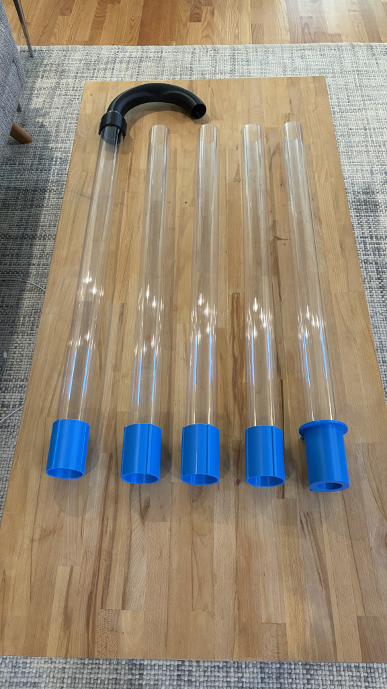
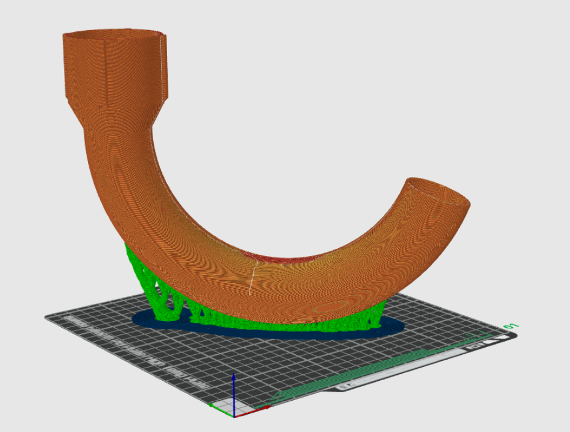

# Gutter Cleaner

I couldn't find a shop vac / leaf blower attachment long enough to handle second floor gutters, so I made this.

  
  

## Usage

I tried using this connected to both my leaf blower and my shop vac. The shop vac was far more effective at removing leaves and sludge. Plus you get to show your friends and family how much you collected. Win win.

## Off the shelf parts

**Shop vac**

I used a RIDGID 9 Gallon 4.25 HP model, but any will do.

**Polycarbonate tubing**

This stuff is silly expensive, but it's the stiffest and lightest available. Believe me, I spent an evening at Home Depot waving every type of plastic and metal tube they had in the air and I wouldn't have felt comfortable waving any of them around at home. As an added bonus, it's crystal clear, so you can see everything getting sucked up, which is entertaining. So get the polycarbonate tubing, otherwise you might end up tired and bored. You've been warned. 

I purchased five 3ft sections of 1/16 inch wall, 2 1/2 inch outer diameter tube from McMaster Carr: https://www.mcmaster.com/8585K32/

If I was purchasing these again I'd consider using a narrower diameter (maybe 2 1/4 inches or 2 inches) to save a little weight and money, and longer sections with fewer couplers to make it stiffer, but shipping costs were higher with longer sections. Overall I'm pretty happy with my end result.

## 3D printed parts

**Units**

All files are metric

**STLs**

* [Nozzle](stl/nozzle.3mf)
* [Coupler](stl/coupler.3mf)
* [Shop Vac Adapter](stl/shop-vac-adapter.3mf)
* [Fit Check Rings](stl/fit-check-rings/)

**FreeCAD file**

* [gutter-cleaner.FCStd](gutter-cleaner.FCStd)

**Getting the right fit**

I've included the STLs that I used for my final prints, but I found that some trial and error was needed to find the right dimensions for a good tight friction fit. This is important, it should be hard to pull the nozzle or couplers off of the tube.

Since your tube, shop vac nozzle, etc may be different dimensions from mine, and your printer and filament will impact how much you need to add for a good fit, I would recommend the following approach:

* Open the FreeCAD file and adjust the following `VarSet` vars based on your tube and shop vac.
  * `pc_tube_od` (outer diameter of your tube)
  * `pc_tube_wall_thickness`
  * `shop_vac_socket_diameter`
* Save the file
* Run the `build` script, which will regenerate the STLs
* Print a few fit check rings. I found a very tight fit at 0.5 mm and a snug fit at 0.8 mm.
* Open the FreeCAD file again and adjust
  * `pc_tube_fit_min` (smallest addition to `pc_tube_od`)
  * `pc_tube_fit_max` (largest addition to `pc_tube_od`)
* Save again
* Re-run the `build` script

**Filament**

You'll want something impact resistant with good Z-layer adhesion. I'd recommend using PETG or ABS/ASA.

**Slicing and Printing**

* Nozzle: This is a bit tricky. I printed it upside down to ensure the best dimensional accuracy of the tube coupler portion and painted on organic tree supports.

* Coupler: Right side up, no support.
* Shop Vac Adapter: Upside down, no support.

## License

This project is licensed under the [Creative Commons Attribution 4.0 International License](http://creativecommons.org/licenses/by/4.0/).

[![CC BY 4.0][cc-by-image]][cc-by]

[cc-by]: http://creativecommons.org/licenses/by/4.0/
[cc-by-image]: https://i.creativecommons.org/l/by/4.0/88x31.png

